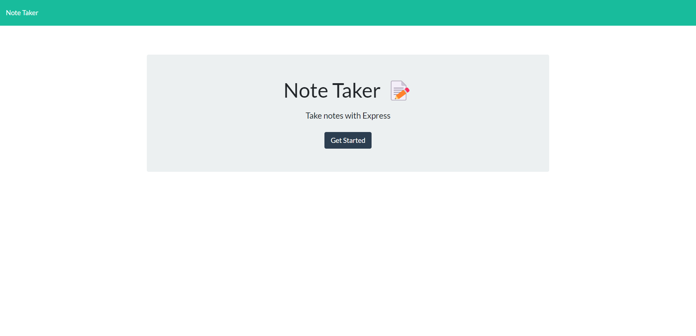
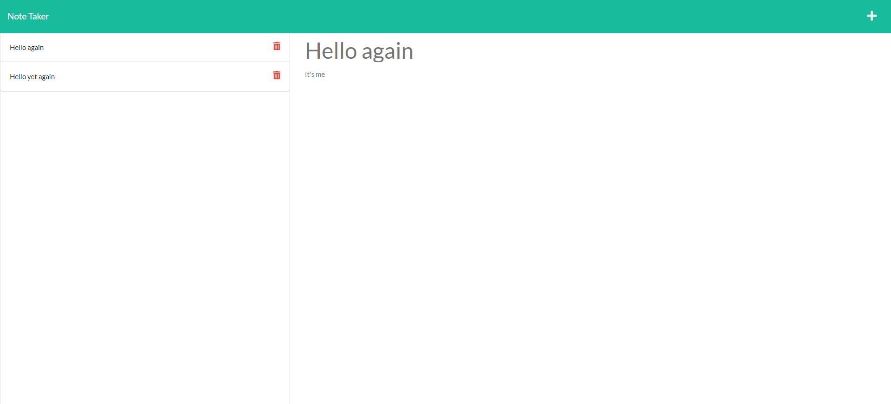
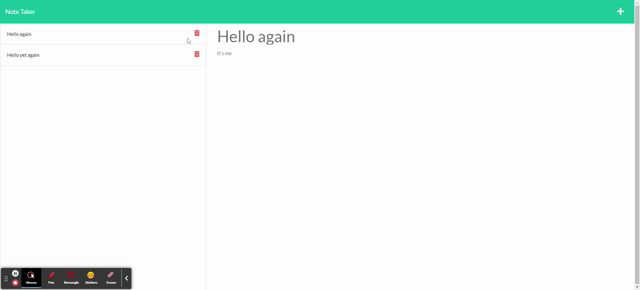

# Note Taker

Deployed Site: https://intense-atoll-93115.herokuapp.com/

Repo: https://github.com/chris-backes/miniature-eureka

## Description

This application began as starter code with the front-end already built-out. the task was to create the backend for persistent storage across devices with express.js.

The application relies on Express.js for its routing and middleware. In addition, other node libraries support this project if production: path for directory navigation, and uuid for unique id generation to attached to the notes as they are stored.

The files which contain code (other than the db and other peripheral bits) which I have contributed are the following (in bold):
<pre>
assets/
db/
    db.json
lib/
    <b>notes.js</b>
public/
    assets/
        css/
            styles.css
        js/
            index.js
    index.html
    notes.html
routes/
    apiRoutes/
        <b>notes.js</b>
    htmlRoutes/
        <b>index.js</b>
<b>server.js</b>

README.md
node_modules/
package.json
package-lock.json
</pre>

## Usage

The application is accessed through a url (provided at the top). The funcitonality is intuitive, with tha capabilities to retrieve notes, add notes, and delete notes. This core fucntionality is contained in the following code (in /routes/apiRoutes/notes.js):

```js
router.get('/notes', (req, res) => {
    res.json(db)
})

router.post('/notes', (req, res) => {
    const { title, text } = req.body
    const id = uuidv4() 
    db.push({ title, text, id })
    fs.writeFileSync('db/db.json', JSON.stringify(db))
    res.json(db)
})

router.delete('/notes/:id', (req, res) => {
    const result = deleteNote(req.body.id, db)
    db.splice(result, 1)
    res.json(db)
})
```

## Media





<p align="center">

</p>

## License

This project is licesned under ISC

## Author

Christopher Backes 

Github: [chris-backes](https://github.com/chris-backes/)